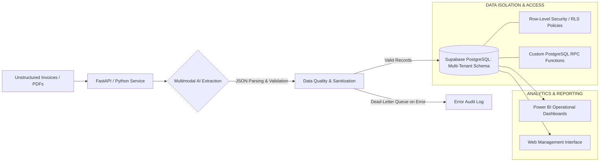

# ⚡ AI Document Ingestion & Multi-Tenant Data Engine

[](https://python.org)
[](https://supabase.com)
[](https://powerbi.microsoft.com)
[](https://fastapi.tiangolo.com)
[](https://ai.google.dev)

A production-grade **financial automation & data pipeline** designed to automate invoice and document processing for corporate operations. The system leverages **multimodal LLMs** to extract structured records from unstructured documents, validates data integrity, and securely stores records in a **multi-tenant PostgreSQL/Supabase database guarded by Row-Level Security (RLS)**. Real-time metrics are served directly to interactive **Power BI dashboards**.

---

## 📐 System Architecture



---

## 🌟 Key Engineering Highlights

### 1. AI-Driven Multimodal Ingestion Pipeline
- Processes unstructured PDF/image invoices through frontier vision LLMs (Claude/Gemini/OpenAI).
- Enforces strict JSON Schema validation, extracting critical financial fields: vendor tax ID, total amount, subtotal, VAT breakdown, issue date, and line-item details.
- **Resilience & Fallback:** Implemented retry logic and a Dead-Letter Queue (DLQ) to ensure anomalous files are flagged for manual review without stalling the pipeline.

### 2. Multi-Tenant Database Architecture & Row-Level Security (RLS)
- Designed normalized schemas in **PostgreSQL / Supabase** supporting multi-tenant client isolation.
- Implemented database-level **Row-Level Security (RLS)** policies ensuring tenants can only access their authorized records, preventing data leaks across organizations.
- Optimized performance via composite B-tree indexes and materialized views for sub-second query latency.

### 3. Real-Time Analytics & Power BI Integration
- Connected Power BI directly to PostgreSQL views and secure REST endpoints.
- Designed comprehensive operational dashboards tracking:
  - Daily/Monthly expense and revenue volume.
  - Tax deduction summaries and category distribution.
  - Processing throughput, pipeline error rates, and automated alerts.

---

## 🛠️ Tech Stack

- **Backend & Automation:** Python 3.10+, FastAPI, Pydantic, Requests, PyMuPDF
- **Database & Security:** Supabase, PostgreSQL 15, Row-Level Security (RLS), PL/pgSQL
- **AI & Extraction:** Multimodal Vision LLMs, Structured Output JSON Schema
- **BI & Visualization:** Power BI, DAX, Vanilla JS / HTML Dashboard
- **Infrastructure:** Docker, REST APIs, Git

---

## 📁 Repository Structure

```
├── src/
│   ├── api/                 # FastAPI endpoints & route handlers
│   ├── ingestion/           # Document parsing & AI extraction engine
│   ├── validators/          # JSON Schema & business rule validation
│   └── database/            # Supabase client & RPC query helpers
├── sql/
│   ├── 01_schema.sql        # Database tables & constraints
│   ├── 02_rls_policies.sql  # Row-Level Security isolation rules
│   └── 03_views_rpc.sql     # Materialized views & reporting RPCs
├── power_bi/                # Power BI templates & DAX measures documentation
└── README.md
```

---

## 🔒 Security Best Practices
- **Zero Hardcoded Secrets:** All credentials, API keys, and connection strings are managed through environment variables (`.env`).
- **Database-Level Isolation:** Access policies are enforced directly in the database engine via PostgreSQL Row-Level Security (`auth.uid() = tenant_id`), preventing horizontal privilege escalation even if application logic is bypassed.

---

## 👨‍💻 Author

**Johan Avalos**  
*Data & Automation Engineer | Databricks Student Fellow*  
[LinkedIn](https://linkedin.com/in/johan-avalos-campos-data) • [GitHub](https://github.com/johanavalosc)
